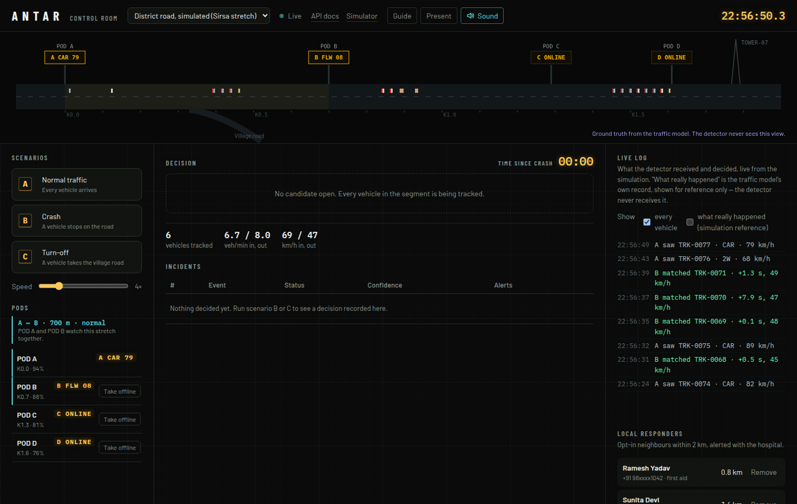
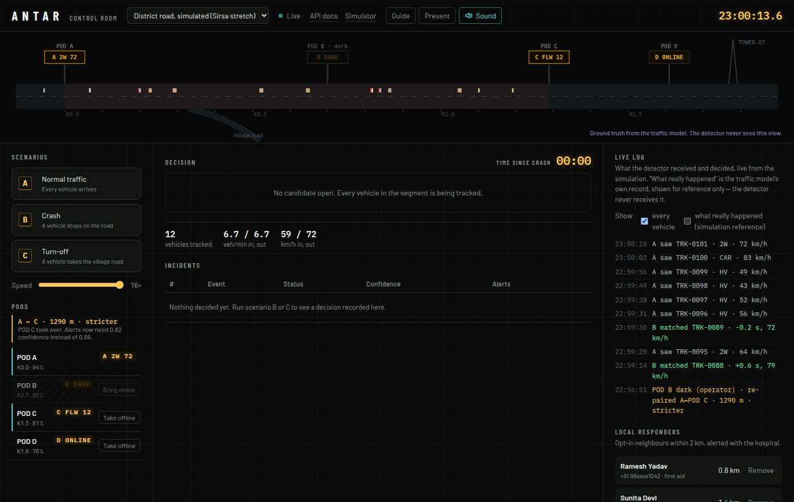
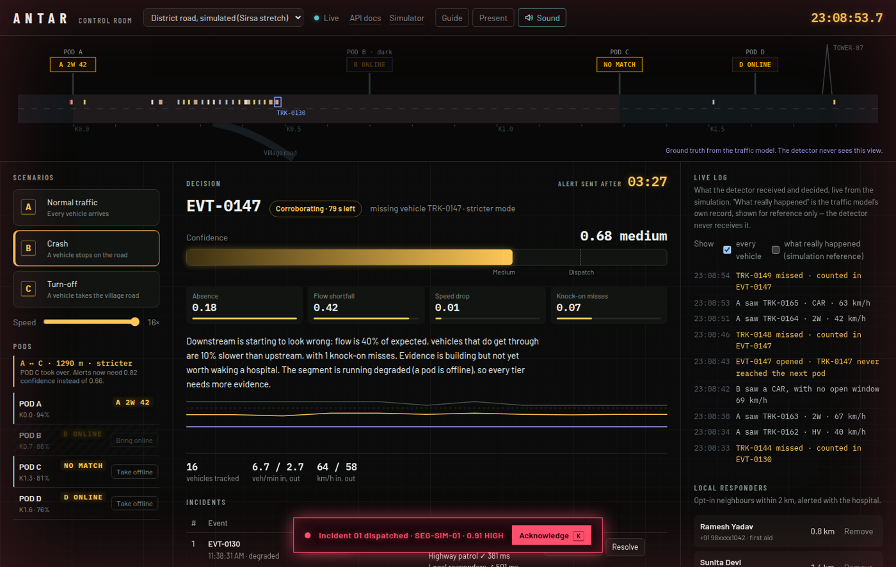

# The control room, and watching ANTAR repair itself

The live demo shows the detection logic. It does **not** show what happens when a pod dies,
because that lives in the optional backend. This page shows you that part — with
screenshots if you don't want to run anything, and five minutes of setup if you do.

Everything here is simulated. No pod exists, and no real hospital, police unit or
volunteer is contacted.

---

## What self-repair means here

Pods work in pairs. POD A predicts when a vehicle should reach POD B, roughly 700 m away.

If POD B goes dark — stolen, flooded, flat battery, hit by a truck — a naive system would
either keep waiting for arrivals that can never be reported, and raise a false alarm for
every vehicle, or stop watching that stretch entirely.

ANTAR does neither. POD A re-pairs with the next pod that is still alive, **POD C at
1290 m**, and openly downgrades its own certainty:

| | Normal | After re-pairing |
|---|---|---|
| Segment watched | 700 m | 1290 m |
| Arrival window | tighter | wider, less precise |
| Confidence needed to alert | 0.66 | **0.82** |
| Early dispatch | allowed | disabled |
| Open windows at the moment of failure | — | voided, so they can't expire as false misses |

The road stays covered, and the system says out loud that it is now less sure. In the
120-run replay the re-paired configuration still separated every crash from every
turn-off — it simply took longer (199 s median instead of 67 s) and the margin narrowed.

---

## If you don't want to run anything

**1. Normal operation.** POD A and POD B are paired. The live log shows what the detector
receives: each vehicle POD A sees, and each one POD B matches.



**2. POD B taken offline.** One click on "Take offline". The pair re-forms as A ↔ C across
1290 m, the log records it, and the panel explains that alerts now need 0.82 confidence
instead of 0.66.



**3. A crash while degraded.** Scenario B with the pod still dark. The decision panel says
"stricter mode" and notes that every tier needs more evidence. It takes far longer than
normal, but the alert still goes out — here at 0.91 confidence.



---

## If you want to run it: five minutes

Needs **Python 3.10 or newer**. Nothing else — the database is SQLite from the standard
library, and there are no external services.

**Windows:** double-click **`run.bat`** in the repository root.
**macOS / Linux:** `./run.sh`

The first run creates a virtual environment and installs FastAPI and uvicorn, which takes
a minute or two. After that it starts immediately and opens
**http://127.0.0.1:8000**.

Prefer to do it by hand?

```
cd backend
python -m venv .venv
.venv\Scripts\activate        # Windows
source .venv/bin/activate     # macOS / Linux
pip install -r requirements.txt
python -m uvicorn antar.api:app --port 8000
```

### Then, in the console

1. **Watch it idle.** Traffic flows, every vehicle is tracked, nothing is dispatched. Drag
   **Speed** up to 4× or 16× so you aren't waiting in real time.
2. **Press Scenario B.** A crash. Watch confidence climb through the evidence panels, then
   the alert, the siren, and the incident appearing in the table with its three
   recipients and their delivery latencies.
3. **Press Acknowledge, then Resolve.** The lifecycle is enforced: you cannot jump
   straight to resolved.
4. **Press Scenario C.** A legal turn-off. Identical absence, no alert.
5. **Now break it.** In the **PODS** panel on the left, click **Take offline** next to
   POD B. The log records the re-pair, and the panel above shows
   `A ↔ C · 1290 m · stricter`.
6. **Press Scenario B again.** A crash on a degraded segment. It takes noticeably longer,
   the decision panel says every tier needs more evidence, and the alert still goes out.
7. **Press Bring online** to restore POD B, and the pair re-forms as A ↔ B.

### Worth knowing while you're in there

- The **live log** defaults to showing every vehicle the detector saw. The
  "what really happened" checkbox adds the traffic model's own record — that is ground
  truth, shown for reference only, and the detector never receives it.
- **http://127.0.0.1:8000/docs** is the full API, clickable. The interesting ones are
  `POST /api/segments/{id}/scenario/{A|B|C}`, `PUT .../pods/{pod}` to take a pod down, and
  `POST .../pass` which is the endpoint a real pod's firmware would post to.
- **`python tools/replay.py`** inside `backend/` re-runs the detector over 120 unseen
  traffic runs and prints the results quoted in the README.
- **`python -m pytest`** inside `backend/` runs all 51 tests.

### If something goes wrong

| Problem | Fix |
|---|---|
| `python` is not recognised | Install Python 3.10+ and tick "Add Python to PATH" |
| Port 8000 is busy | `python -m uvicorn antar.api:app --port 8100`, then open that port |
| The page loads but stays empty | The WebSocket is blocked; try another browser, or disable a strict ad-blocker |
| No sound on the alert | Browsers block audio until you click something on the page |

None of this is needed to judge the prototype. The simulator at the live link is the
prototype; this is the control room that would sit behind it.
